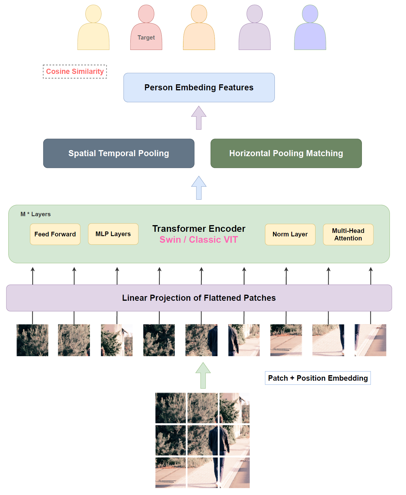
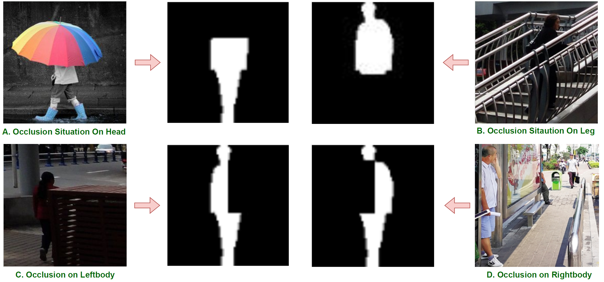

## Occlusion-TransGait:

In this work, we use two class transformer based backbone VIT and Swin-Transformer to extract global contextual information and attention feature from sequential images. From result, the Swin based model improved by 0.4% on NM, 1.0% on BG and 1.4% on CL.

We use OpenGait as our code framework and add some feature like Transformer based backbone, mask data generation pipeline. OpenGait is a flexible and extensible gait recognition project provided by the [Shiqi Yu Group](https://github.com/ShiqiYu/OpenGait)

## Getting Started

Please see [0.get_started.md](docs/0.get_started.md). We also provide the following tutorials for your reference:
- [Prepare dataset](docs/2.prepare_dataset.md)
- [Detailed configuration](docs/3.detailed_config.md)
- [Customize model](docs/4.how_to_create_your_model.md)
- [Advanced usages](docs/5.advanced_usages.md) 

## Masked Datasets

We use mask_data.py to generate [Occlusion-Gait](https://drive.google.com/drive/folders/1RdZXe0PhjJoM7K41Uf42V5NyzkkBMygm?usp=drive_link ) dataset
